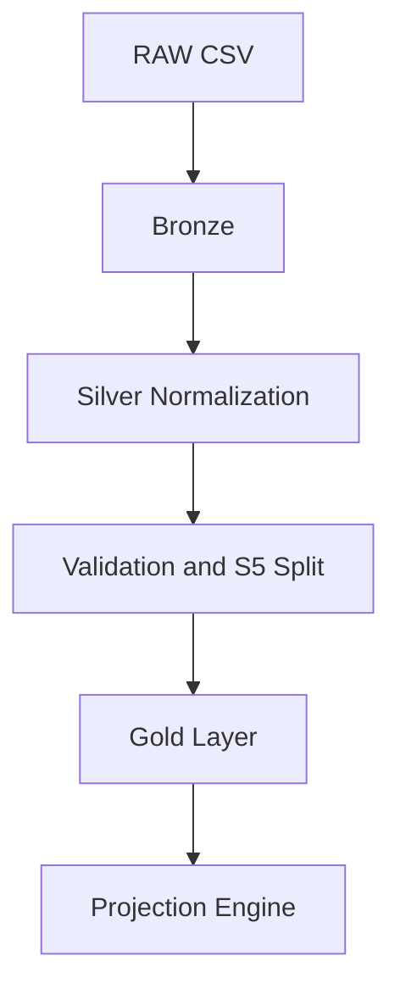

# Revenue Integrity Pipeline

Multi-tenant medallion ETL architecture with Silver-layer defensive normalization, S5 forensic quarantine routing, and revenue projection modeling. Engineered for multi-client onboarding with config-driven schema handling, audit-safe orchestration, and zero-loss row integrity guarantees.

## Core Design Principle

**Invariant: Input Rows = Gold Rows + S5 Rows**

This pipeline guarantees complete data lineage and row-level observability through explicit data integrity checks, defensive parsing with remediation tracking, and configurable validation rules.

## Architecture Diagram



## Key Features

- **Defensive Parsing**: All data transformations return metadata flags (value, s5_flag, remediated) for complete auditability
- **Multi-Tenant Isolation**: Client-scoped configs isolate blast radius—schema drift in one client doesn't impact others
- **S5 Exception Routing**: Malformed or high-risk rows are bifurcated into forensic buffer, preserving Gold-layer analytical integrity
- **Audit-Safe Orchestration**: Timestamped logs and client-scoped output directories enable end-to-end traceability

## Structure

- `templates/pipeline_config.py`: Copy and customize for each client.
- `templates/loss_projection_engine.py`: Shared projection script driven by client config.
- `clients/client_name_001/raw_data.csv`: Client source data.
- `clients/client_name_001/client_config.py`: Client-specific schema and projection settings.
- `clients/client_name_001/output/`: Logs and generated outputs.
- `cleanup_engine.py`: Core cleanup engine.
- `run_pipeline.py`: Orchestrates cleanup + projection for one client.

## New Client Setup

1. Create a folder under `clients/` (example: `clients/acme_2026_05`).
2. Copy `templates/pipeline_config.py` to `clients/acme_2026_05/client_config.py`.
3. Put source data at `clients/acme_2026_05/raw_data.csv`.
4. Run with a specific client folder name (or omit to use the default pointer):

```powershell
python .\run_pipeline.py acme_2026_05
```

## Projection Controls

The projection engine now supports maturity controls to keep long-range projections financially plausible and operationally defensible.

- `projection_mode`: `conservative`, `moderate`, or `aggressive`
- `max_monthly_growth`: optional hard cap override for monthly growth
- `monthly_growth_damping`: optional monthly damping factor
- `min_confident_baseline_months`: minimum baseline months before confidence downgrade
- `low_confidence_max_horizon_months`: automatic horizon clamp when baseline history is limited

Default behavior:

- If baseline history is thin (for example, fewer than 6 months), the engine downgrades mode, reduces growth assumptions, shortens horizon, and prints warnings.
- If configured revenue column is missing, the engine derives revenue from `quantity * unit_price` when available.

## Notes

- `run_pipeline.py` writes a timestamped log to the selected client output folder.
- Projection uses settings from `client_config.py`:
  - `review_date`
  - `projection_months`
  - `projection_revenue_col`
  - `projection_date_col`
  - `projection_mode`
  - `min_confident_baseline_months`
  - `low_confidence_max_horizon_months`
- Output files use safe-write behavior: if a target CSV is locked/open, the pipeline writes a timestamped fallback file instead of hard-failing.
