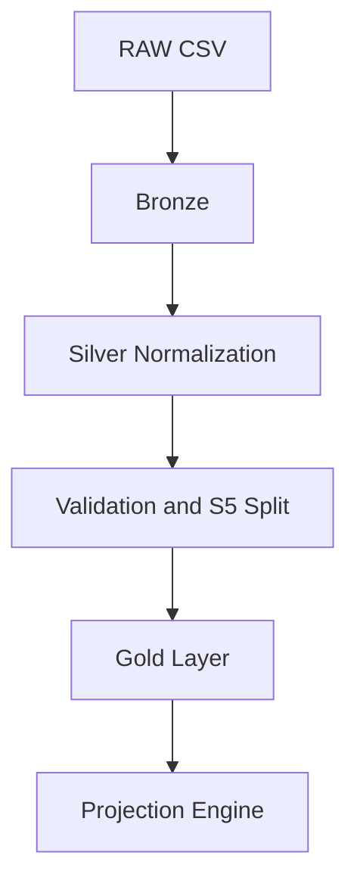

# Forensic Revenue Pipeline

Modular, production-grade data pipeline with forensic data validation, S5 quarantine routing, and revenue-loss projection.

This project is organized for reusable client onboarding.

## Architecture Diagram



## Structure

- `templates/pipeline_config.py`: Copy and customize for each client.
- `templates/loss_projection_engine.py`: Shared projection script driven by client config.
- `clients/client_name_001/raw_data.csv`: Client source data.
- `clients/client_name_001/client_config.py`: Client-specific schema and projection settings.
- `clients/client_name_001/output/`: Logs and generated outputs.
- `cleanup_engine.py`: Core cleanup engine.
- `run_pipeline.py`: Orchestrates cleanup + projection for one client.

## New Client Setup

1. Create a folder under `clients/` (example: `clients/acme_2026_05`).
2. Copy `templates/pipeline_config.py` to `clients/acme_2026_05/client_config.py`.
3. Put source data at `clients/acme_2026_05/raw_data.csv`.
4. Update `run_pipeline.py` value of `CLIENT_NAME`.
5. Run:

```powershell
python .\run_pipeline.py
```

## Notes

- `run_pipeline.py` writes a timestamped log to the selected client output folder.
- Projection uses settings from `client_config.py`:
  - `review_date`
  - `projection_months`
  - `projection_revenue_col`
  - `projection_date_col`
